# C4 Model

## 系统上下文图

系统上下文图是软件系统绘图与文档记录的理想起点，能让你跳出细节、把握全局。绘制该图时，需将你的系统以方框形式置于中心，周围环绕其用户及与之交互的其他系统。
此处无需关注细节，因为这是展现系统全景的宏观视图。重点应放在人员（参与者、角色、用户画像等）与软件系统上，而非技术、协议及其他底层细节。这类图甚至可以展示给非技术人员看。


## 容器图

在 C4 架构模型中，“容器” 指应用程序或数据存储。例如，服务端 Web 应用、客户端单页应用、桌面应用、移动应用、数据库模式、文件系统中的文件夹、亚马逊云服务 S3 存储桶等，都属于 “容器” 范畴。
容器图会展示软件架构的高层级结构，以及职责在架构中的分布方式；同时也会呈现主要技术选型，还有各容器之间的通信方式。这是一种简洁、聚焦技术的高层级图表，对软件开发人员、技术支持 / 运维人员而言都具有实用价值。


## 组件图


## 代码图


# arc42

## 1. 介绍和目标

1. 需求的简要描述、驱动因素、需求提炼。
2. 对需求主要干系人优先级最高的 3-5 项质量目标。
3. 重要干系人以及他们的期望。


## 2. 约束

任何会在设计、实现决策或相关流程决策方面对团队构成约束的事物。这类事物有时可能超出单个系统的范畴，对整个组织或公司都适用。

## 3. 上下文和作用域

明确你的系统与其（外部）通信对象（相邻系统及用户）之间的边界。该边界需定义外部接口，并始终从业务 / 领域视角呈现，也可根据需要从技术视角呈现（可选）。

### 3.1. 业务上下文


### 3.2. 技术上下文


## 4. 解决策略

构成架构核心的基础性决策与解决方案策略摘要。

内容可包括技术选型、顶层分解方案、实现核心质量目标的方法，以及相关的组织层面决策。

## 5. 构建视图

系统的静态分解（即源代码的抽象表示），以 “白盒（内含黑盒）” 的层级结构呈现，分解深度需达到适宜的详细程度。

### 5.1. Level1


### 5.2. Level2


### 5.3. Level3


## 6. 运行视图

组件的行为以场景形式呈现，涵盖重要用例或功能、关键外部接口的交互过程、运行与管理操作，以及错误与异常行为。


## 7. 部署视图

包含环境、计算机、处理器、拓扑结构的技术基础设施，以及（软件）构件到基础设施元素的映射关系。


## 8. 横切关注点

“Crosscutting” 译为 “横切”（而非 “交叉”），强调其 “跨越多个模块 / 构件边界” 的特性 —— 这类概念不隶属于某一个特定的功能模块，而是贯穿于系统的多个组成部分，如同 “横向切割” 系统的多个模块；“Concepts” 译为 “关注点”（而非 “概念”），更贴合技术语境，特指系统设计中需要重点考虑的核心逻辑或需求（如日志、安全、事务等）。

例如：某金融系统的横切规范中，会包含 “基于领域驱动设计（DDD）构建领域模型”（领域模型）、“采用微服务架构模式”（架构模式）、“所有外部接口遵循 REST 风格”（架构风格）、“数据库操作必须使用 ORM 框架”（特定技术使用规则）、“代码需符合公司 Java 编码规范”（实现规范）等内容，这些规范贯穿 “账户系统”“交易系统”“风控系统” 等多个构件，确保系统设计与实现的全局一致性。

### 8.1 领域模型


## 9. 架构决定

重要、高成本、关键、大规模或高风险的架构决策，含决策依据。

## 10. 质量需求

以场景形式呈现的质量需求，辅以质量树用于提供高层级概览。其中最重要的质量目标应已在 1.2 节（质量目标）中说明。

## 11. 风险和技术债

已识别的技术风险或技术债务。系统内部或系统周边存在哪些潜在问题？开发团队对哪些问题感到困扰？

## 12. 术语表

干系人讨论系统时所使用的重要领域术语与技术术语。此外，若在多语言环境下工作，还需包含术语的对照参考（即不同语言间的术语对应关系）。


# 技术绘图

## 在线编辑

plantUML

https://www.plantuml.com/plantuml/uml/SyfFKj2rKt3CoKnELR1Io4ZDoSa700001

mermaid:

https://mermaid-live.nodejs.cn/edit

## 类图


### 简介

类用于描述系统中具有相似角色的对象，包括：
* 结构特征（属性）
    * 代表了类对象的状态
    * 类结构和静态特征的描述
* 行为特征（操作）
    * 对象能够执行的动作
    * 对象之间可能的交互方式

### 组成

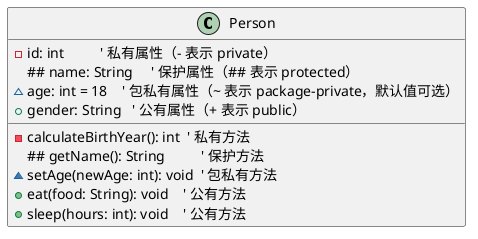


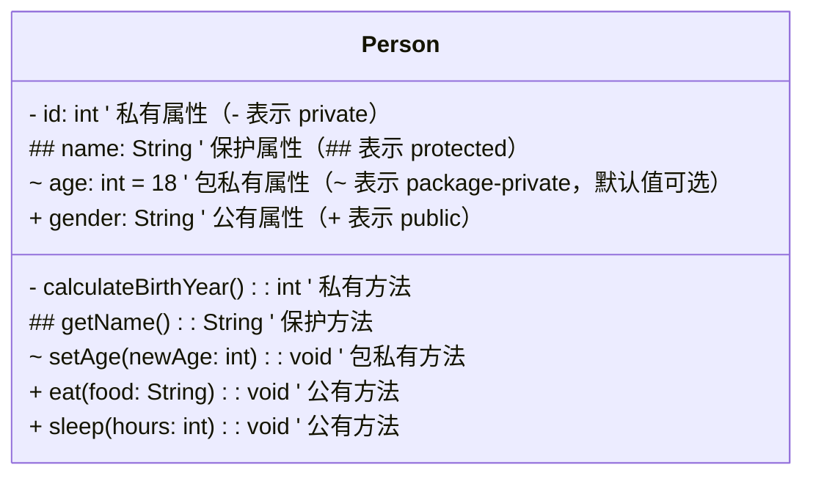


### 类之间的关系

##### 继承

> 继承是一个指向父类的空心箭头实线

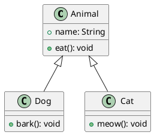


mermaid

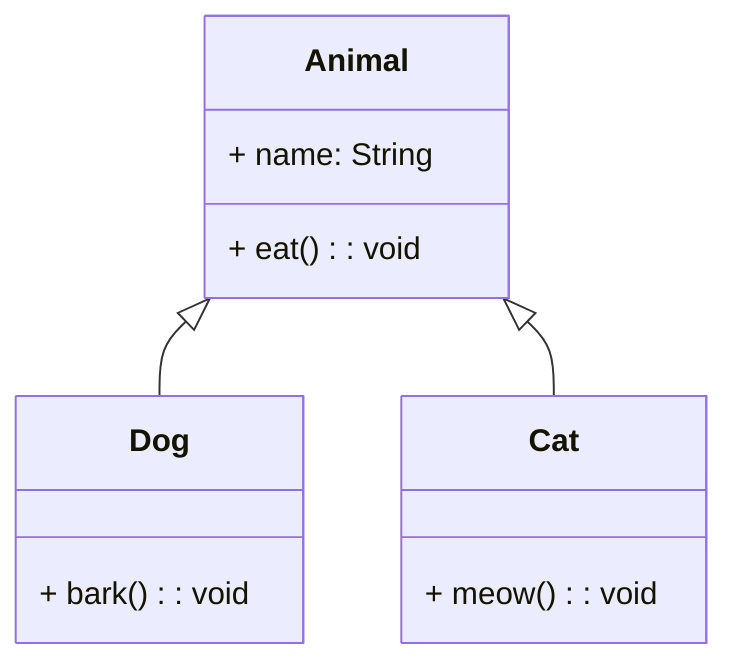


##### 实现

> 实现是一个指向接口的空心箭头虚线

代表类实现接口

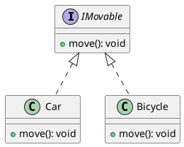


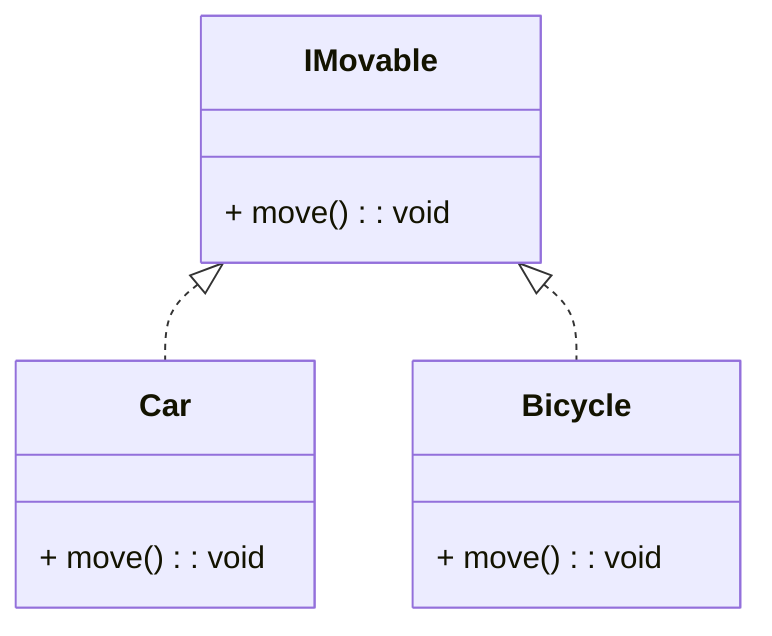


##### 聚合

> 聚合是空心菱形在整体，可以脱离的关系

整体-部分的关系，部分可以脱离整体。

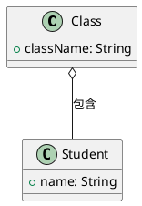


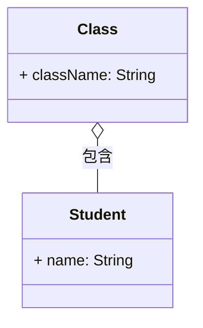


##### 组合

部分不能脱离整体而存在，心脏不能脱离人体而存在。

> 聚合是实心菱形在整体，不可以脱离的关系

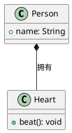


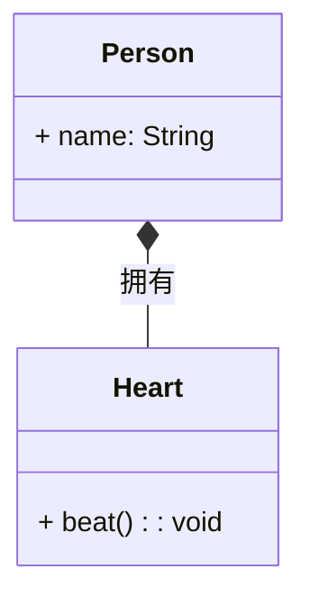


##### 依赖

临时依赖，一个类使用另一个类的方法，但是没有长期依赖。

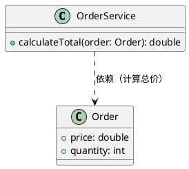


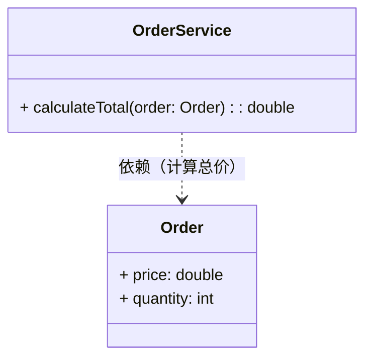


##### 关联

表示类之间的普通联系，例如用户有订单，老师教学生。

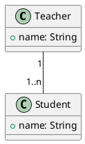


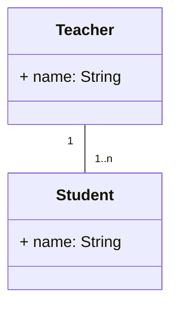


## 组件图

组件图是一种结构图，用来展示系统中组件之间的组织结构、依赖关系和交互方式。

组件是系统中可替换的单元，具有明确的接口，能够独立完成特定的功能。

* 封装性：内部实现细节对外部隐藏，仅通过接口交互。
* 可替换性：符合相同接口的组件可以相互替换。

作用：

1. 展示系统物理结构：将系统分解为可管理的组件，清晰呈现模块划分。
2. 描述组件依赖：显示哪些组件依赖其他组件。
3. 指导部署：为后续的部署图提供基础，明确组件如何部署到硬件。

### 接口


* 提供接口（Provided Interface）：其符号末端带有完整圆形，代表组件对外提供的接口。这种 “棒棒糖”（lollipop）符号是接口分类器实现关系（realization relationship）的简化表示。
* 需求接口（Required Interface）：其符号末端仅有半个圆形（又称 “插座”，socket），代表组件所需的接口。
（两种情况下，接口名称均需标注在接口符号附近。）

```plantuml
component CreateOrder

component OrderSystem

() "order" as ord
ord - OrderSystem
CreateOrder ..( ord
```


### 依赖

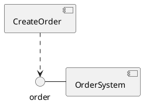


### 组件嵌套

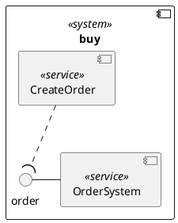


## 序列图

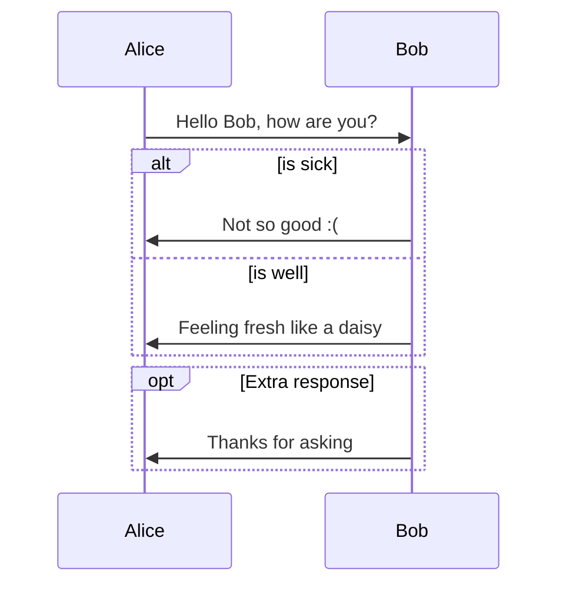


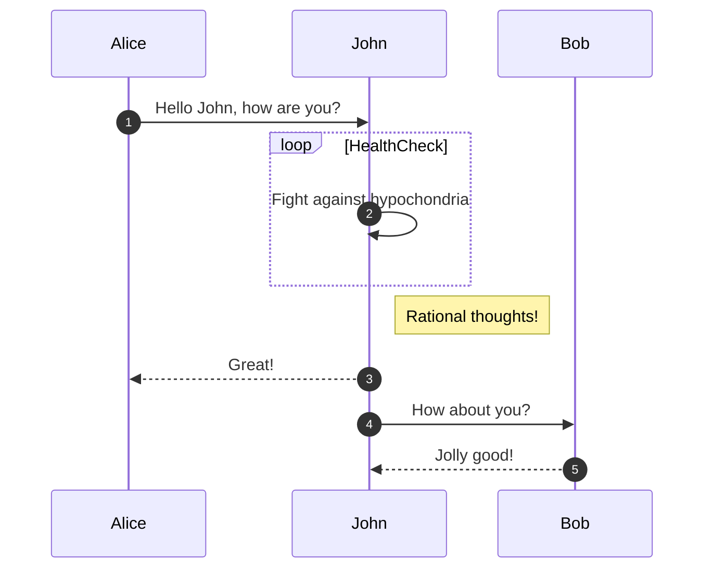


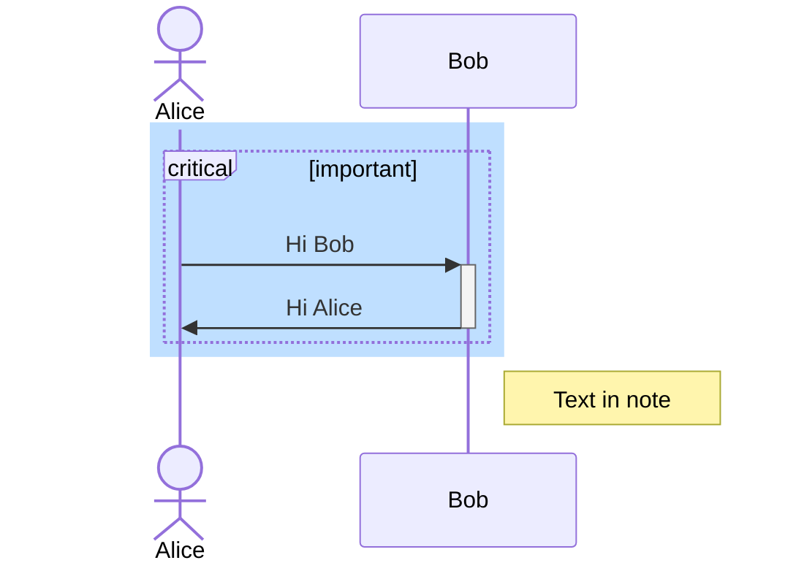


## ER 图

```mermaid
erDiagram
    CAR ||--o{ NAMED-DRIVER : allows
    CAR {
        string registrationNumber PK
        string make
        string model
        string[] parts
    }
    PERSON ||--o{ NAMED-DRIVER : is
    PERSON {
        string driversLicense PK "The license ##"
        string(99) firstName "Only 99 characters are allowed"
        string lastName
        string phone UK
        int age
    }
    NAMED-DRIVER {
        string carRegistrationNumber PK, FK
        string driverLicence PK, FK
    }
    MANUFACTURER only one to zero or more CAR : makes
```


## 泳道流程图


## 产品架构图


## 活动图

```plantuml
@startuml
title 登录流程（含重试）

start
:输入用户名和密码;
:attempt = 1;

while (attempt <= 3?) is (是)
  :校验凭证;

  if (校验通过?) then (是)
    :生成会话 token;
    :进入系统;
    stop
  else (否)
    :提示账号或密码错误;
    :attempt = attempt + 1;
  endif

endwhile (否)

:锁定账号或提示稍后再试;
stop
@enduml
```

