# 在线编辑

plantUML

https://www.plantuml.com/plantuml/uml/SyfFKj2rKt3CoKnELR1Io4ZDoSa700001

mermaid:

https://mermaid-live.nodejs.cn/edit

# 类图


## 简介

类用于描述系统中具有相似角色的对象，包括：
* 结构特征（属性）
    * 代表了类对象的状态
    * 类结构和静态特征的描述
* 行为特征（操作）
    * 对象能够执行的动作
    * 对象之间可能的交互方式

## 组成

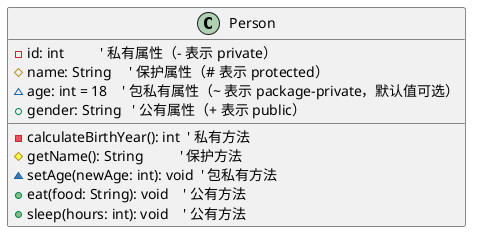


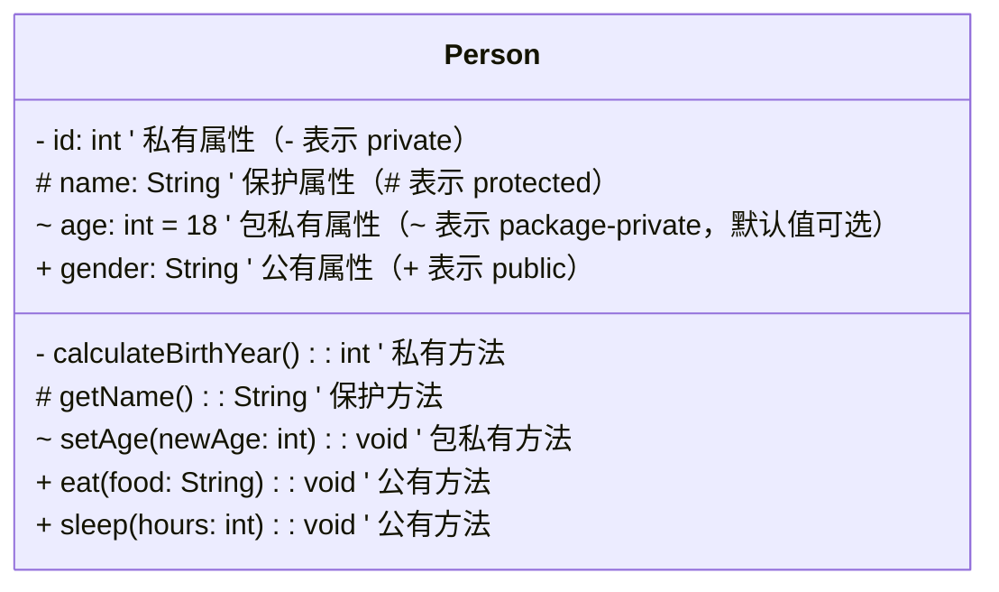


## 类之间的关系

### 继承

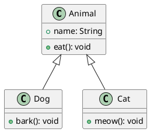


mermaid

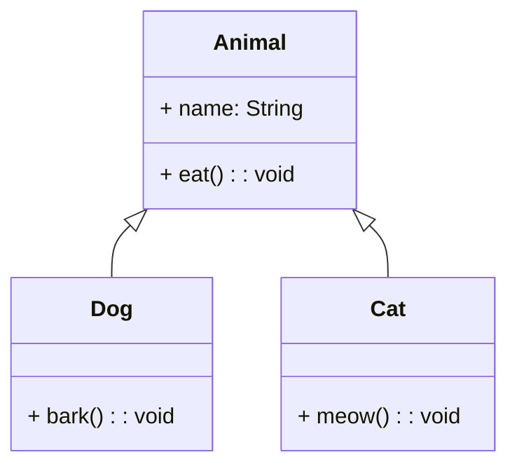


### 实现

代表类实现接口

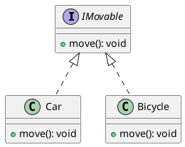


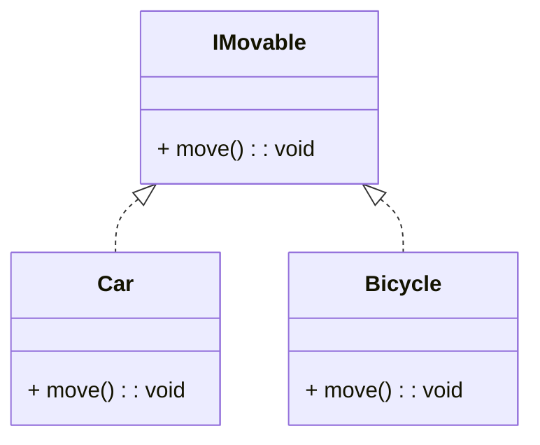


### 聚合

整体-部分的关系，部分可以脱离整体。

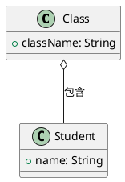


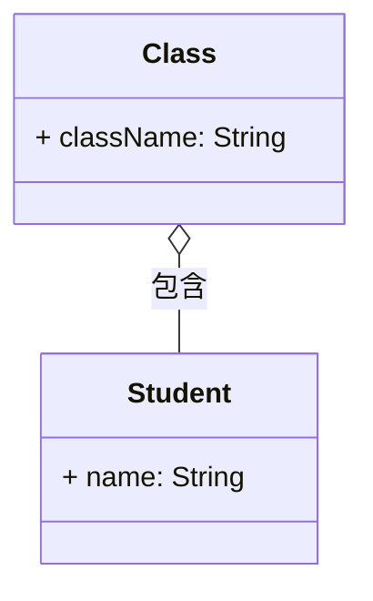


### 组合

部分不能脱离整体而存在，心脏不能脱离人体而存在。

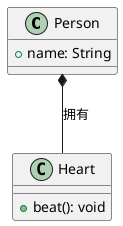


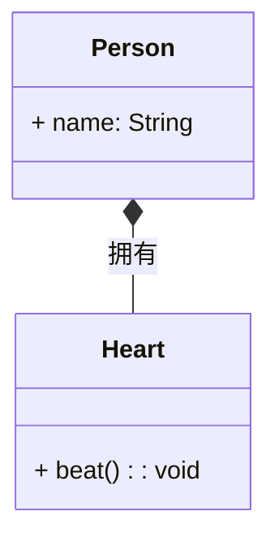


### 依赖

临时依赖，一个类使用另一个类的方法，但是没有长期依赖。

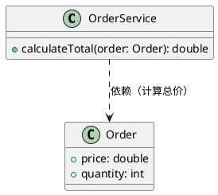


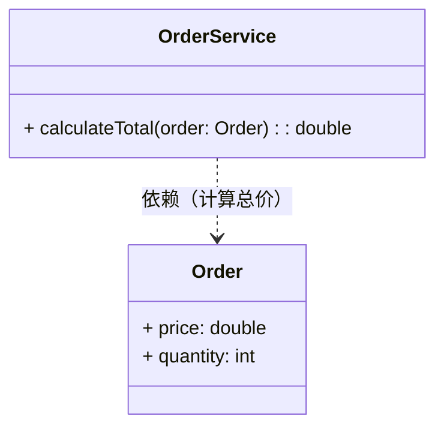


### 关联

表示类之间的普通联系，例如用户有订单，老师教学生。

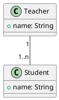


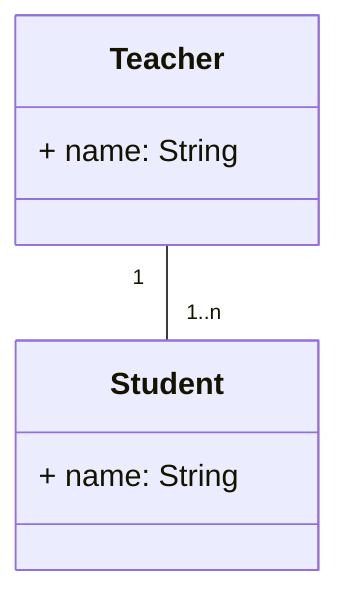


# 组件图

组件图是一种结构图，用来展示系统中组件之间的组织结构、依赖关系和交互方式。

组件是系统中可替换的单元，具有明确的接口，能够独立完成特定的功能。

* 封装性：内部实现细节对外部隐藏，仅通过接口交互。
* 可替换性：符合相同接口的组件可以相互替换。

作用：

1. 展示系统物理结构：将系统分解为可管理的组件，清晰呈现模块划分。
2. 描述组件依赖：显示哪些组件依赖其他组件。
3. 指导部署：为后续的部署图提供基础，明确组件如何部署到硬件。

## 接口


* 提供接口（Provided Interface）：其符号末端带有完整圆形，代表组件对外提供的接口。这种 “棒棒糖”（lollipop）符号是接口分类器实现关系（realization relationship）的简化表示。
* 需求接口（Required Interface）：其符号末端仅有半个圆形（又称 “插座”，socket），代表组件所需的接口。
（两种情况下，接口名称均需标注在接口符号附近。）

```plantuml
component CreateOrder

component OrderSystem

() "order" as ord
ord - OrderSystem
CreateOrder ..( ord
```


## 依赖

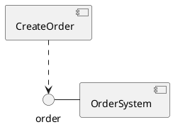


## 组件嵌套

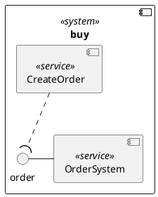


# 序列图

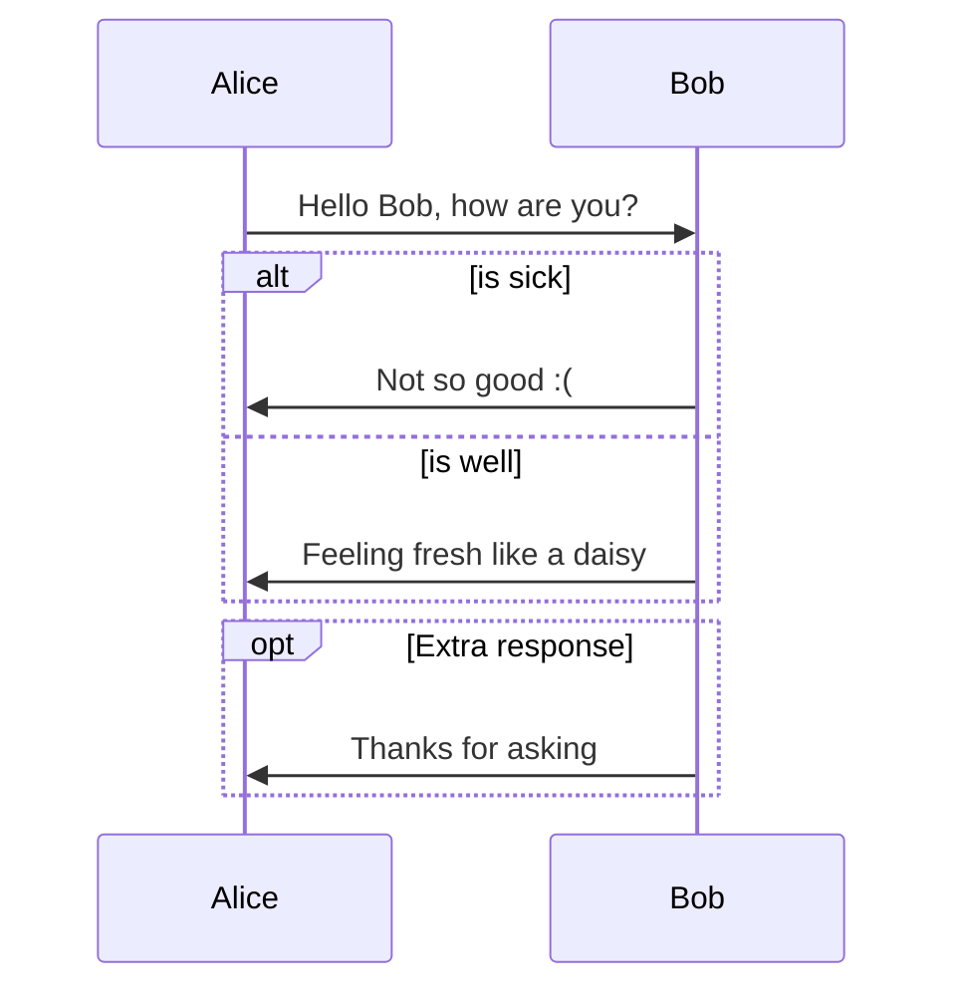


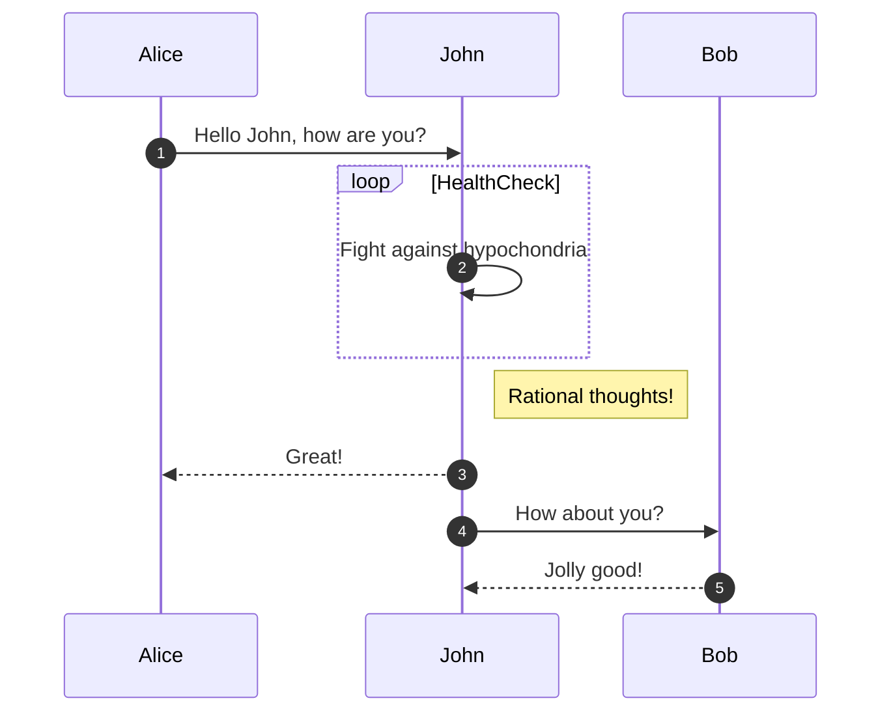

